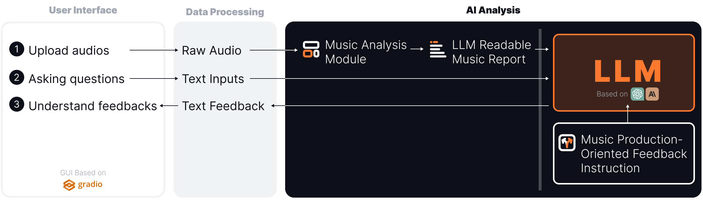

This is the demo page for the paper **"AI TrackMate: Finally, Someone Who’ll Give Your Music More Than Just ’Sounds Great!’"**.

## Abstract

The rise of \emph{"bedroom producers"} has democratized music creation, but challenges producers to objectively evaluate their work. We present AI TrackMate, an LLM-based music chatbot designed to provide constructive feedback on music productions. Unlike previous approaches, AI TrackMate leverages the inherent musical knowledge of LLMs and focuses on production-oriented feedback. Our framework consists of a Music Analysis Module, an LLM Readable Music Report, and Production-Oriented Feedback Instruction for LLM. This plug-and-play, training-free system is compatible with various LLMs and adaptable to future advancements. We demonstrate AI TrackMate through an interactive web interface and conduct a pilot study with a music producer. By bridging AI capabilities with the needs of independent producers, AI TrackMate offers round-the-clock, nuanced feedback, potentially transforming the creative process and skill development in music production.

### System

The system comprises three layers:

1. User Interface for audio upload, query input, and feedback reception
2. Data Processing for handling raw audio and text
3. AI Analysis, featuring a Music Analysis Module that transforms raw audio into LLM-readable reports, and an LLM that processes these reports along with user queries. Guided by music production-oriented feedback instructions, the LLM generates insights comparable to those of a music producer.

### Examples

#### Videos

#### Text

### Contact

Bo-Yu Chen: bernie40916@gmail.com
